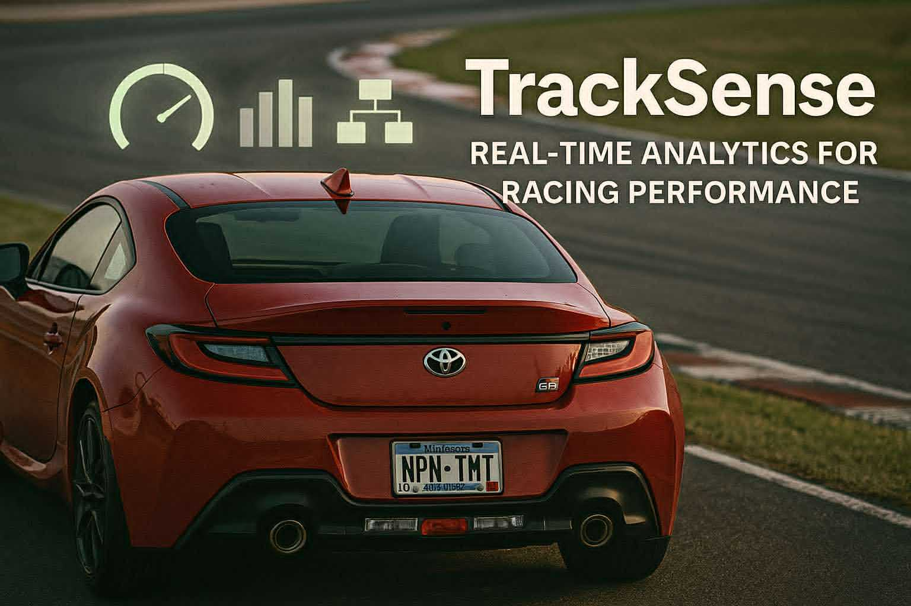
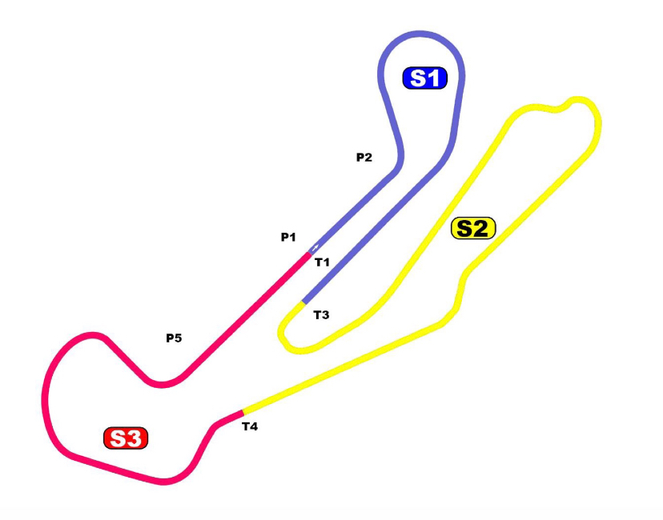

<div id="top">

<!-- HEADER STYLE: CLASSIC -->
<div align="center">



# DATASCIENCE HACK BY TOYOTA – Hack The Track

<em>Accelerate Insights, Dominate Race Strategies Instantly</em>

<!-- BADGES -->


<em>Built with the tools and technologies:</em>


<br>


</div>
<br>

---

## 📄 Table of Contents

- [Overview](#-overview)
- [Inspiration](#-inspiration)
- [What It Does](#-what-it-does)
- [How We Built It](#-how-we-built-it)
- [Challenges We Ran Into](#-challenges-we-ran-into)
- [Accomplishments That We’re Proud Of](#-accomplishments-that-were-proud-of)
- [What We Learned](#-what-we-learned)
- [Whats Next for Racing Hokies](#-whats-next-for-racing-hokies)
- [Tech Stack](#-tech-stack)
- [Data Sources](#-data-sources)
- [Getting Started](#-getting-started)
    - [Prerequisites](#-prerequisites)
    - [Installation](#-installation)
    - [Usage](#-usage)
    - [Testing](#-testing)
- [Features](#-features)
- [Project Structure](#-project-structure)
    - [Project Index](#-project-index)
- [Roadmap](#-roadmap)
- [Contributing](#-contributing)
- [License](#-license)
- [Acknowledgment](#-acknowledgment)

---

## ✨ Overview

DataScienceHackbyToyota is an advanced simulation and analysis platform built around **Toyota GR86 GR Cup** data, with a focus on **Barber Motorsports Park**. It combines interactive visualizations, large-scale telemetry processing, and AI-driven insights (via **Google Gemini 2.5 Flash**) to help a race engineer answer questions like:

- *What’s our ideal pit window right now?*
- *How fast are our tyres degrading by stint and by sector?*
- *What should we do if a caution comes out in the next 2–3 laps?*
- *If we box now, do we win or lose track position by the flag?*

The system links:

- A **Tkinter + Matplotlib race map** with a moving car icon, running on the actual digitised Barber layout.
- A **Streamlit “race engineer console”** that updates from a live JSON state file.
- A **strategy engine** that simulates tyre degradation, pit windows, caution scenarios, and “mini multiverse” Monte Carlo races.
- **Gemini 2.5 Flash** for real-time natural-language insights, radio messages, and decision reviews.
- A **predictive lap-time model** (Random Forest) trained on GR86 lap features.
- An experimental **computer-vision pipeline** using Gemini Vision on sample GR86 images.

---

## 💡 Inspiration

In modern motorsport, races are often decided by **fractions of a second** and **one pit call**. A mistimed stop or a slow reaction to a Safety Car can cost **multiple positions and tens of seconds** of race time, even when the driver’s pace is strong.

At the the same time, a single car can generate **millions of telemetry data points per race** (speed, throttle, brake, tyres, weather, timing, gaps, etc.). Race engineers have to digest all of this under pressure, in real time, while talking to the driver and coordinating with the team.

We wanted to build a tool that acts like an **AI co-engineer**: watching the data continuously, surfacing only what matters (“box now”, “tyre cliff in 3 laps”, “caution window coming”), and **turning RAW NUMBERS 🔜 DECISIONS**.

---

## 🏎️ What It Does

Our project turns real GR86 GR Cup data into an **interactive race-strategy cockpit** for Barber Motorsports Park:

- 🏁 **Live track sim** – a car icon runs around a digitised Barber circuit map based on lap timing and stint logic.
- 📊 **Real-time strategy console** – every second, the app updates:
  - Tyre phase (warm-up / stable / degradation)  
  - Net gain/loss if we pit now vs 2 laps earlier/later  
  - Caution / Safety-Car “what if” (next 3 laps)
  - Clean air vs traffic risk, gaps ahead/behind
- 📈 **Predictive lap-time model** – Random Forest model trained on lap features (`aps_mean`, `pbrake_f_mean`, …) for `GR86-002-000 @ Barber R2`, with:
  - RMSE and R² validation metrics
  - Comparison plots: actual vs predicted lap times, residuals, parity plot
  - Serialized model + JSON metadata for use in the app
- 🤖 **Gemini-powered race engineer radio** – Gemini 2.5 Flash reads the current lap metrics plus notebook insights and generates **short, actionable radio calls**:
  - “Box now under caution – you’ll undercut P5 by ~1.2s”
  - “Stay out, overcut in clean air, target 2 laps more”
  - “Tyres stable – push S2, save S3”
- 💬 **Strategy Chat** – a chat assistant that:
  - Sees track & car context, best strategy table, and current lap snapshot
  - Answers engineer-style questions in plain English
  - Stays grounded in the numbers and cites which metrics it used
- 🧠 **Decision Reviewer** – an AI “second pair of eyes”:
  - You describe your intended radio call (“Box now for 4 tyres and fuel to the end”)
  - Gemini reviews it with the current race context and returns:
    - Verdict (Go / Borderline / Don’t do it)
    - Rationale and key risks
    - Safer alternative calls
- 👁️ **Vision + Gemini** – an experimental computer-vision notebook:
  - Uses Gemini 2.5 Flash (vision) on `data/vision/sample_gr86_barber.png`
  - Asks the model to describe car position, lane usage, runoff, and risk
  - Aggregates outputs into simple stats and a plot (e.g. lane-centre histogram)

---

## 🛠️ How We Built It

### Data

We used the official TRD hackathon dataset from:  
https://trddev.com/hackathon-2025/

Key Barber files (race 1 & 2):

- `R1_barber_telemetry_data.csv` – **11,556,519 rows × 13 columns**  
- `R2_barber_telemetry_data.csv` – **11,749,604 rows × 13 columns**  
- Plus timing, weather, sector stats and results files — about **20 CSV files** in total.

We pre-processed these into lap-level features and strategy summaries (see `/data/processed` and the analysis notebooks `03–11_barber_*.ipynb`).

### Core stack

- **Python**, **NumPy**, **pandas** – data processing, lap & stint features, tyre-deg models  
- **Matplotlib** – live animation of the car icon moving around the digitised Barber map and plotting strategy / model results  
- **Streamlit** – race-engineer dashboard with tabs:
  - Strategy Brain
  - Driver Insights
  - Predictive Models
  - Strategy Chat
  - Live Race Copilot  
- **scikit-learn** – Random Forest regression for lap-time prediction  
- **Google Gemini 2.5 Flash** – chat, radio-style strategy calls, decision review, and experimental vision  
- **Tkinter / Matplotlib backends** – local animation window that writes a `live_state` JSON  
- **Custom modules**:
  - `strategy_engine.py` – degradation modeling, pit window simulation, Monte Carlo strategy multiverse  
  - `pit_model.py` – stint segmentation and simple deg curves  
  - `track_meta.py` – track metadata, pit-lane loss assumptions  
  - `live_state.py` – atomic JSON sync between animation and Streamlit  
  - `predictive_models.py` – lap-time model training / saving / inference  
  - `chat_assistant.py` – LLM-powered strategy chat context builder  
  - `decision_reviewer.py` – structured AI review of engineer calls  
  - `vision_gemini.py` – helper for running Gemini vision analysis over images  

The desktop animation (`barber_lap_anim.py`) continuously updates a JSON file (`data/live/live_state_barber.json`). The Streamlit app (`streamlit_app.py`) reads that same state up to once per second, recomputes metrics, optionally calls Gemini, and renders the UI.

---

## 🧗 Challenges We Ran Into

- **Handling huge telemetry files** – reading >11 million-row CSVs per race meant we had to be careful with memory, summarising to lap/stint-level data before doing heavier modeling.
- **Keeping everything in sync** – we needed the Matplotlib animation, JSON writer, and Streamlit dashboard to stay in lockstep without race conditions or crashes.
- **Prompt design for Gemini** – making sure the AI produces short, trustworthy, race-engineer-style bullet points instead of essays was an iteration loop of its own.
- **Unifying many tools** – predictive model, chat, decision review, and vision all had to coexist cleanly inside a single Streamlit file.

---

## 🏆 Accomplishments That We’re Proud Of

- Turning **raw GR Cup telemetry** into a **live strategy simulator** that really feels like a race-engineer console, not just static plots.
- Building an **AI radio feed** that reacts to tyre life, pit window, and caution scenarios in language a driver could actually understand mid-race.
- Shipping a working **lap-time Random Forest model** with sane metrics and visual diagnostics.
- Creating a **modular pipeline**: notebooks → processed features → strategy engine → live animation → Streamlit + Gemini.

---

## 📚 What We Learned

- How quickly motorsport data explodes in size, and why **aggregation & feature engineering** are critical before doing any fancy modeling.
- The importance of **race-decision framing**: engineers don’t want “here’s every metric,” they want “what should we do this lap and why?”.
- How to combine classical modeling (tyre deg, pit-lane loss, Monte Carlo strategies) with **LLM-synthesised insights** so the AI is grounded in real numbers.
- Practical patterns for safely using **Gemini 2.5 Flash** for both chat and structured decision review.

---

## 🔮 Whats Next for Racing Hokies

- ❯❯❯❯ **The Future** – expand real-time voice assistant, deeper AI decision reviewer, richer computer vision system, and more predictive models.
- 💠 **Multi-car & multi-track support** – extend to more GR Cup cars and to VIR using the rest of the TRD dataset.  
- 🌐 **Cloud + live feed** – adapt the pipeline to live telemetry streams and host the dashboard so a team can connect during a session.  
- 🧠 **Richer “what-if” engine** – allow the engineer to simulate alternative strategies (extra stop, short-fill, extreme fuel save) and compare projected race time in real time.  
- 👂 **Driver-aware coaching** – incorporate driver consistency, error patterns, and sector strengths into the radio calls (“strong in S1, losing time in S3 braking zone – adjust bias + lift earlier”).

By combining **real-world-scale data**, **physics-style models**, and **LLM insights**, our goal is to give race engineers a tool that doesn’t just visualise the race — it **helps call it**.

---

## 🧩 Tech Stack

**Languages & Libraries**

- Python, NumPy, pandas, SciPy  
- Matplotlib, Seaborn (in notebooks)  
- scikit-learn (Random Forest regression)  

**Frameworks & Platforms**

- Streamlit – interactive race engineer dashboard  
- Tkinter + Matplotlib – local live animation window  
- Jupyter – data exploration and model development  

**AI & APIs**

- Google Gemini 2.5 Flash (text & vision) via `google-generativeai`  

**Data & Storage**

- CSV-based telemetry & timing data (TRD dataset)  
- JSON live state in `data/live/*.json`  
- Joblib + JSON for model artifacts in `models/`  

**Tooling**

- GitHub for version control  
- VS Code / JupyterLab for development  

---

## 📊 Data Sources

This project uses **official hackathon data and maps** from:

- **TRD Dev – DataScienceHackbyToyota 2025**  
  Dataset page: `https://trddev.com/hackathon-2025/`

- **Barber Motorsports Park telemetry bundle**  
  File: `barber-motorsports-park.zip`  
  ~20 CSV files including:
  - `R1_barber_telemetry_data.csv` — **Rows:** 11,556,519 • **Cols:** 13  
  - `R2_barber_telemetry_data.csv` — **Rows:** 11,749,604 • **Cols:** 13  
  plus lap timing, weather, best-10 laps, results, etc.

- **Barber circuit map (official PDF)**  
  URL: `https://trddev.com/hackathon-2025/Barber_Circuit_Map.pdf`

In this repo, the track map image used for digitising and visualisation is:

```text
data/track_maps/IMG_4381.jpg
```

Embedded preview:



The digitised centerline (from manual clicks on this map) lives in:

```text
data/track_geom/barber_track_xy.csv
data/track_geom/barber_track_xy_s.csv
```

These are what the **car icon animation** and strategy tools use.

---

## 🚀 Getting Started

### 📋 Prerequisites

- **Python:** 3.10+ (tested with 3.10 / 3.11 / 3.13)
- **Package Manager:** `pip`
- (Optional) **virtualenv / venv** for isolation
- (Optional but recommended) **Google Gemini API key** for AI insights (chat, decision review, vision)

### ⚙️ Installation

1. **Clone the repository**

```sh
git clone https://github.com/ngstephen1/DataScienceHackbyToyota.git
cd DataScienceHackbyToyota
```

2. **Create & activate a virtual environment (recommended)**

```sh
python -m venv .venv
source .venv/bin/activate        # on macOS / Linux
# .venv\Scripts\Activate       # on Windows PowerShell
```

3. **Install dependencies**

```sh
pip install -r requirements.txt
```

4. **(Optional) Configure Gemini**

Set your Gemini API key and model name (Gemini 2.5 Flash):

```sh
export GEMINI_API_KEY="your-key-here"
export GEMINI_MODEL_NAME="gemini-2.5-flash"
```

On Windows PowerShell:

```powershell
$env:GEMINI_API_KEY="your-key-here"
$env:GEMINI_MODEL_NAME="gemini-2.5-flash"
```

You can quickly verify the key with:

```sh
python - << 'PY'
import os, google.generativeai as genai
api_key = os.getenv("GEMINI_API_KEY")
model_name = os.getenv("GEMINI_MODEL_NAME", "gemini-2.5-flash")
if not api_key:
    raise SystemExit("GEMINI_API_KEY is not set.")
genai.configure(api_key=api_key)
print(f"Trying model: {model_name}")
model = genai.GenerativeModel(model_name)
resp = model.generate_content("Say exactly: Gemini OK.")
print("Response:", resp.text.strip())
PY
```

---

### ▶️ Usage

There are **two main entrypoints**: the **animated map** and the **Streamlit race-engineer console**. They communicate through `data/live/` JSON files.

#### 1. Run the animated Barber map (Tkinter + Matplotlib)

This opens a window showing the **Barber map** with a **car icon** moving along the digitised track, plus real-time metrics and Gemini insights:

```sh
python src/barber_lap_anim.py
```

This script:

- Loads the Barber track map (`data/track_maps/IMG_4381.jpg`).
- Loads digitised centerline from `data/track_geom/barber_track_xy_s.csv`.
- Reads lap features and strategy summaries from `data/processed/barber/...`.
- Animates one car icon per lap based on lap times.
- Writes live state to:

```text
data/live/barber_state.json
data/live/live_state_barber.json
```

#### 2. Run the Streamlit “Race Engineer Console”

In another terminal (same venv):

```sh
streamlit run streamlit_app.py
```

The Streamlit app provides multiple tabs:

- **Strategy Brain** – strategy multiverse, caution simulation, best strategy summary  
- **Driver Insights** – lap & sector trends, tyre phases, consistency  
- **Predictive Models** – Random Forest lap-time model summary and diagnostic plots  
- **Strategy Chat** – Gemini 2.5 Flash chat assistant with full race context  
- **Live Race Copilot** – live state from animation, decision reviewer, and AI radio  

If your Gemini key is configured, you’ll also see **Gemini insights** and **decision review** outputs (short bullet-point radio style).

> 💡 **Tip**  
> For a complete “live” demo, run:
> - Terminal 1: `python src/barber_lap_anim.py`  
> - Terminal 2: `streamlit run streamlit_app.py`

---

### 🧪 Testing

There is **no full automated test suite** yet. For a quick sanity check:

```sh
python tests/manual_test.py
```

This exercises core loading and geometry logic to ensure things run without errors.

(You’re encouraged to add `pytest` tests for `src/` modules if you extend this project.)

---

## 📦 Features

|      | Component       | Details                                                                                     |
| :--- | :-------------- | :------------------------------------------------------------------------------------------ |
| ⚙️  | **Architecture**  | <ul><li>Modular Jupyter Notebook workflows for data analysis and modeling</li><li>Separation of data processing (`src/`), visualization (`barber_lap_anim.py`, `streamlit_app.py`), and strategy logic (`strategy_engine.py`)</li></ul> |
| 🔩 | **Code Quality**  | <ul><li>Clear function boundaries in modules</li><li>Notebooks used for exploratory analysis, with logic gradually migrated into reusable functions</li></ul> |
| 📄 | **Documentation** | <ul><li>README with overview, data sources, and how to run</li><li>`RUN.md` for step-by-step setup and demo instructions</li></ul> |
| 🔌 | **Integrations**  | <ul><li>`requirements.txt` for dependency management</li><li>Integrates `numpy`, `pandas`, `matplotlib`, `streamlit`, `google-generativeai`, `scikit-learn`</li></ul> |
| 🧩 | **Modularity**    | <ul><li>Separate notebooks for VIR vs Barber, race 1 vs race 2</li><li>Reusable strategy, track-meta, telemetry loader, predictive modeling, chat, decision review, and vision modules</li></ul> |
| 🧪 | **Testing**       | <ul><li>Basic manual tests via `tests/manual_test.py` (no formal unit test suite yet)</li></ul> |
| ⚡️  | **Performance**   | <ul><li>Handles 10M+ row telemetry CSVs using `pandas` and columnar workflows</li><li>Animation and dashboard driven by pre-aggregated lap features</li></ul> |
| 🛡️ | **Security**      | <ul><li>No external services beyond Gemini API; API key is read from environment variables</li></ul> |
| 📦 | **Dependencies**  | <ul><li>Managed via `requirements.txt`</li><li>Includes `jupyter`, `streamlit`, `matplotlib`, `pandas`, `numpy`, `ipykernel`, `google-generativeai`, `scikit-learn`</li></ul> |

---

## 📁 Project Structure

```sh
└── DataScienceHackbyToyota/
    ├── README.md
    ├── RUN.md
    ├── data
    │   ├── raw/            # Original TRD telemetry, results, weather, etc.
    │   ├── processed/      # Derived lap features, sector summaries, strategy outputs
    │   ├── track_geom/     # Digitised track centerline for Barber
    │   ├── track_maps/     # Track images (PDF-derived JPG/PNG) + car icon
    │   └── vision/         # Sample GR86 images for Gemini vision
    ├── models
    │   ├── lap_time_barber_GR86-002-000.joblib
    │   └── lap_time_barber_GR86-002-000.json
    ├── notebooks           # VIR + Barber exploration, lap times, sections, strategy MVP
    │   ├── 01_explore_vir.ipynb
    │   ├── 02_vir_sectors_r1r2.ipynb
    │   ├── 03_barber_telemetry_r1.ipynb
    │   ├── 04_barber_lap_times_r1.ipynb
    │   ├── 05_barber_sections_r1.ipynb
    │   ├── 06_barber_telemetry_r2.ipynb
    │   ├── 07_barber_lap_times_r2.ipynb
    │   ├── 08_barber_sections_r2.ipynb
    │   ├── 09_barber_driver_profile.ipynb
    │   ├── 10_barber_strategy_mvp.ipynb
    │   ├── 11_barber_predictive_model.ipynb
    │   └── 13_vir_telemetry_r1.ipynb
    ├── requirements.txt
    ├── src
    │   ├── __init__.py
    │   ├── barber_build_track_s.py
    │   ├── barber_digitize_track.py
    │   ├── barber_lap_anim.py
    │   ├── chat_assistant.py
    │   ├── decision_reviewer.py
    │   ├── live_state.py
    │   ├── pit_model.py
    │   ├── predictive_models.py
    │   ├── strategy_cli.py
    │   ├── strategy_engine.py
    │   ├── telemetry_loader.py
    │   ├── test.py
    │   ├── track_meta.py
    │   ├── track_utils.py
    │   └── vision_gemini.py
    ├── streamlit_app.py   # Live dashboard / race engineer console
    ├── tests
    │   └── manual_test.py
    └── tools
        └── extract_barber_r1_vehicle.py
```

---

### 📑 Project Index

<details open>
	<summary><b><code>DataScienceHackbyToyota/</code></b></summary>
	<!-- __root__ Submodule -->
	<details>
		<summary><b>__root__</b></summary>
		<blockquote>
			<div class='directory-path' style='padding: 8px 0; color: #666;'>
				<code><b>⦿ __root__</b></code>
			<table style='width: 100%; border-collapse: collapse;'>
			<thead>
				<tr style='background-color: #f8f9fa;'>
					<th style='width: 30%; text-align: left; padding: 8px;'>File Name</th>
					<th style='text-align: left; padding: 8px;'>Summary</th>
				</tr>
			</thead>
				<tr style='border-bottom: 1px solid #eee;'>
					<td style='padding: 8px;'><b><a href='https://github.com/ngstephen1/DataScienceHackbyToyota/blob/master/README.md'>README.md</a></b></td>
					<td style='padding: 8px;'>- The provided code file, <code>README.md</code>, serves as the foundational documentation for the DATASCIENCE HACK BY TOYOTA-Hack The Track project<br>- Its primary purpose is to introduce the project’s goal of leveraging data science techniques to optimize race strategies, enabling users to gain rapid insights and make data-driven decisions in racing scenarios<br>- The README offers an overview of the project’s objectives, highlights its key features, and provides contextual information to orient users and contributors within the overall architecture<br>- It acts as a gateway to understanding how this codebase fits into Toyota’s broader initiative to accelerate insights and dominate race strategies through data science.</td>
				</tr>
				<tr style='border-bottom: 1px solid #eee;'>
					<td style='padding: 8px;'><b><a href='https://github.com/ngstephen1/DataScienceHackbyToyota/blob/master/streamlit_app.py'>streamlit_app.py</a></b></td>
					<td style='padding: 8px;'>- Streamlit_app.pyThis script serves as the central entry point for the applications user interface, orchestrating various components to deliver an integrated experience<br>- It leverages multiple modules to facilitate decision review, predictive modeling, conversational assistance, and visual analysis within a cohesive Streamlit-based frontend<br>- By managing data paths, initializing live state storage, and coordinating interactions, this file enables users to analyze race data, receive insights, and interact with AI-driven tools seamlessly, thereby supporting the broader architecture of a race analysis and decision support platform.</td>
				</tr>
				<tr style='border-bottom: 1px solid #eee;'>
					<td style='padding: 8px;'><b><a href='https://github.com/ngstephen1/DataScienceHackbyToyota/blob/master/requirements.txt'>requirements.txt</a></b></td>
					<td style='padding: 8px;'>- Defines project dependencies essential for data analysis, visualization, and machine learning tasks<br>- Ensures all necessary libraries are available for building, training, and deploying models, as well as creating interactive dashboards and conducting exploratory data analysis within the broader architecture<br>- Supports seamless environment setup to facilitate efficient development and reproducibility across the entire codebase.</td>
				</tr>
				<tr style='border-bottom: 1px solid #eee;'>
					<td style='padding: 8px;'><b><a href='https://github.com/ngstephen1/DataScienceHackbyToyota/blob/master/RUN.md'>RUN.md</a></b></td>
					<td style='padding: 8px;'>- Provides step-by-step instructions to set up and launch the web-based visualization for the Barber project<br>- It guides users through cloning the repository, creating an isolated environment, installing dependencies, and running the Streamlit application<br>- This facilitates interactive exploration of data insights, integrating seamlessly into the overall data science workflow within the project architecture.</td>
				</tr>
			</table>
		</blockquote>
	</details>
	<!-- src Submodule -->
	<details>
		<summary><b>src</b></summary>
		<blockquote>
			<div class='directory-path' style='padding: 8px 0; color: #666;'>
				<code><b>⦿ src</b></code>
			<table style='width: 100%; border-collapse: collapse;'>
			<thead>
				<tr style='background-color: #f8f9fa;'>
					<th style='width: 30%; text-align: left; padding: 8px;'>File Name</th>
					<th style='text-align: left; padding: 8px;'>Summary</th>
				</tr>
			</thead>
				<tr style='border-bottom: 1px solid #eee;'>
					<td style='padding: 8px;'><b><a href='https://github.com/ngstephen1/DataScienceHackbyToyota/blob/master/src/predictive_models.py'>predictive_models.py</a></b></td>
					<td style='padding: 8px;'>- Provides tools for training, saving, loading, and applying machine learning models to predict lap times based on lap summary features<br>- Facilitates quick deployment of models for real-time or batch predictions, supporting analysis and optimization of driving performance across different tracks and vehicles within the overall racing simulation or telemetry system.</td>
				</tr>
				<tr style='border-bottom: 1px solid #eee;'>
					<td style='padding: 8px;'><b><a href='https://github.com/ngstephen1/DataScienceHackbyToyota/blob/master/src/chat_assistant.py'>chat_assistant.py</a></b></td>
					<td style='padding: 8px;'>- Provides a GPT-powered interface for race strategy and telemetry analysis in GT racing<br>- It generates contextual summaries, evaluates driver pace, and formulates radio-style responses to engineering questions by integrating static race data and live telemetry snapshots<br>- This facilitates real-time strategic decision-making and communication, enhancing race management and driver support within the overall system architecture.</td>
				</tr>
				<tr style='border-bottom: 1px solid #eee;'>
					<td style='padding: 8px;'><b><a href='https://github.com/ngstephen1/DataScienceHackbyToyota/blob/master/src/pit_model.py'>pit_model.py</a></b></td>
					<td style='padding: 8px;'>- Implements a vehicle lap analysis pipeline that detects pit laps, segments laps into stints, and models lap time degradation over race duration<br>- Facilitates understanding of performance decline, enabling insights into vehicle wear and strategy optimization within the broader race data architecture.</td>
				</tr>
				<tr style='border-bottom: 1px solid #eee;'>
					<td style='padding: 8px;'><b><a href='https://github.com/ngstephen1/DataScienceHackbyToyota/blob/master/src/barber_digitize_track.py'>barber_digitize_track.py</a></b></td>
					<td style='padding: 8px;'>- Provides an interactive tool to digitize the Barber Motorsports Park track centerline by allowing users to click along the track map<br>- If interactivity isnt available, generates a synthetic oval track as a fallback<br>- Outputs normalized and pixel coordinates of the track centerline to a CSV file, integrating seamlessly into the larger project architecture focused on track geometry analysis and visualization.</td>
				</tr>
				<tr style='border-bottom: 1px solid #eee;'>
					<td style='padding: 8px;'><b><a href='https://github.com/ngstephen1/DataScienceHackbyToyota/blob/master/src/telemetry_loader.py'>telemetry_loader.py</a></b></td>
					<td style='padding: 8px;'>- Provides tools to load, process, and summarize vehicle telemetry data from CSV files<br>- Facilitates lap and sector identification based on distance metrics, enabling detailed per-lap analysis and track segmentation<br>- Supports flexible data extraction for performance metrics, supporting race analysis, track mapping, and telemetry-driven insights within the overall simulation or racing data architecture.</td>
				</tr>
				<tr style='border-bottom: 1px solid #eee;'>
					<td style='padding: 8px;'><b><a href='https://github.com/ngstephen1/DataScienceHackbyToyota/blob/master/src/strategy_engine.py'>strategy_engine.py</a></b></td>
					<td style='padding: 8px;'>- Provides a comprehensive framework for simulating and optimizing race strategies by modeling lap times, tyre degradation, and caution effects<br>- Facilitates evaluation of pit stop timing, race outcomes, and probabilistic scenarios through Monte Carlo simulations, supporting real-time analytics and decision-making in race engineering and strategy planning.</td>
				</tr>
				<tr style='border-bottom: 1px solid #eee;'>
					<td style='padding: 8px;'><b><a href='https://github.com/ngstephen1/DataScienceHackbyToyota/blob/master/src/vision_gemini.py'>vision_gemini.py</a></b></td>
					<td style='padding: 8px;'>- Provides tools for analyzing race track images using a generative AI model to extract detailed vehicle and track insights<br>- Facilitates batch processing of images, generating structured statistics on car detection, positioning, speed, and risk levels<br>- Includes visualization functions to summarize lane positioning and risk trends across multiple frames, supporting race strategy and safety assessments within the overall system architecture.</td>
				</tr>
				<tr style='border-bottom: 1px solid #eee;'>
					<td style='padding: 8px;'><b><a href='https://github.com/ngstephen1/DataScienceHackbyToyota/blob/master/src/track_utils.py'>track_utils.py</a></b></td>
					<td style='padding: 8px;'>- Provides functionality to determine the current sector of a vehicle based on its lap distance within a racing circuit<br>- It leverages track metadata to map a given distance to one of three predefined sectors, supporting real-time race analysis and telemetry processing within the overall track management system.</td>
				</tr>
				<tr style='border-bottom: 1px solid #eee;'>
					<td style='padding: 8px;'><b><a href='https://github.com/ngstephen1/DataScienceHackbyToyota/blob/master/src/test.py'>test.py</a></b></td>
					<td style='padding: 8px;'>- Visualizes the digitized centerline of the Barber track by loading coordinate data and generating a scaled plot<br>- It supports the broader project by providing a clear graphical representation of track geometry, facilitating analysis and validation within the overall data processing and simulation workflows<br>- This enhances understanding of track layout essential for modeling and testing purposes.</td>
				</tr>
				<tr style='border-bottom: 1px solid #eee;'>
					<td style='padding: 8px;'><b><a href='https://github.com/ngstephen1/DataScienceHackbyToyota/blob/master/src/barber_lap_anim.py'>barber_lap_anim.py</a></b></td>
					<td style='padding: 8px;'>- The <code>src/barber_lap_anim.py</code> file is a core component responsible for visualizing and animating lap data within the project<br>- It orchestrates the creation of dynamic, interactive plots that depict lap progressions, leveraging data processing and visualization libraries<br>- Additionally, it integrates live state management by exporting real-time updates to JSON, facilitating seamless updates and external integrations<br>- This module plays a pivotal role in translating raw lap metrics into insightful, animated representations, thereby supporting analysis and presentation of racing performance within the overall architecture.</td>
				</tr>
				<tr style='border-bottom: 1px solid #eee;'>
					<td style='padding: 8px;'><b><a href='https://github.com/ngstephen1/DataScienceHackbyToyota/blob/master/src/live_state.py'>live_state.py</a></b></td>
					<td style='padding: 8px;'>- Manages persistent storage of live state data for individual tracks within the project<br>- Facilitates saving and retrieving real-time status information by generating standardized file paths and ensuring atomic updates<br>- Supports the overall architecture by maintaining up-to-date, reliable state information crucial for real-time processing and data consistency across the system.</td>
				</tr>
				<tr style='border-bottom: 1px solid #eee;'>
					<td style='padding: 8px;'><b><a href='https://github.com/ngstephen1/DataScienceHackbyToyota/blob/master/src/track_meta.py'>track_meta.py</a></b></td>
					<td style='padding: 8px;'>- Defines metadata for various race tracks, including identifiers, names, pit lane times, lengths, and optional geometric paths<br>- Serves as a centralized reference for track-specific information, supporting accurate simulation, analysis, and visualization within the broader racing data processing architecture<br>- Facilitates consistent access to track attributes across the project.</td>
				</tr>
				<tr style='border-bottom: 1px solid #eee;'>
					<td style='padding: 8px;'><b><a href='https://github.com/ngstephen1/DataScienceHackbyToyota/blob/master/src/barber_build_track_s.py'>barber_build_track_s.py</a></b></td>
					<td style='padding: 8px;'>- Calculates and appends normalized and cumulative arc length data to track geometry, enabling precise spatial analysis within the overall racing simulation architecture<br>- Facilitates accurate positioning and timing along the track by transforming raw coordinate data into standardized distance metrics, supporting downstream components such as vehicle dynamics, telemetry, and visualization modules.</td>
				</tr>
				<tr style='border-bottom: 1px solid #eee;'>
					<td style='padding: 8px;'><b><a href='https://github.com/ngstephen1/DataScienceHackbyToyota/blob/master/src/decision_reviewer.py'>decision_reviewer.py</a></b></td>
					<td style='padding: 8px;'>- Provides an AI-powered review mechanism for race engineer decisions during live races<br>- It evaluates proposed strategic calls by leveraging a generative model to generate structured, markdown-formatted feedback, including verdicts, rationales, risks, and safer alternatives<br>- When the AI model is unavailable, it defaults to a rule-based heuristic, ensuring continuous decision support within the race strategy architecture.</td>
				</tr>
				<tr style='border-bottom: 1px solid #eee;'>
					<td style='padding: 8px;'><b><a href='https://github.com/ngstephen1/DataScienceHackbyToyota/blob/master/src/strategy_cli.py'>strategy_cli.py</a></b></td>
					<td style='padding: 8px;'>- Provides a command-line interface for recommending optimal pit strategies in racing scenarios by analyzing lap data, simulating various strategies, and evaluating their performance under different caution conditions<br>- Integrates track metadata and lap features to generate probabilistic insights, enabling users to select strategies with the highest win probability and best race time across multiple simulated universes.</td>
				</tr>
			</table>
		</blockquote>
	</details>
	<!-- models Submodule -->
	<details>
		<summary><b>models</b></summary>
		<blockquote>
			<div class='directory-path' style='padding: 8px 0; color: #666;'>
				<code><b>⦿ models</b></code>
			<table style='width: 100%; border-collapse: collapse;'>
			<thead>
				<tr style='background-color: #f8f9fa;'>
					<th style='width: 30%; text-align: left; padding: 8px;'>File Name</th>
					<th style='text-align: left; padding: 8px;'>Summary</th>
				</tr>
			</thead>
				<tr style='border-bottom: 1px solid #eee;'>
					<td style='padding: 8px;'><b><a href='https://github.com/ngstephen1/DataScienceHackbyToyota/blob/master/models/lap_time_barber_GR86-002-000.json'>lap_time_barber_GR86-002-000.json</a></b></td>
					<td style='padding: 8px;'>- Provides a JSON model representing lap time predictions for a specific track and vehicle, capturing key features and performance metrics<br>- It supports the broader architecture by enabling data-driven analysis and validation of vehicle performance models, facilitating insights into how selected features influence lap times and aiding in the refinement of predictive accuracy within the racing simulation ecosystem.</td>
				</tr>
				<tr style='border-bottom: 1px solid #eee;'>
					<td style='padding: 8px;'><b><a href='https://github.com/ngstephen1/DataScienceHackbyToyota/blob/master/models/lap_time_barber_GR86-002-000.joblib'>lap_time_barber_GR86-002-000.joblib</a></b></td>
					<td style='padding: 8px;'>Certainly! Please provide the code file youd like me to summarize, along with any additional context or project structure details youd like me to consider.</td>
				</tr>
			</table>
		</blockquote>
	</details>
	<!-- notebooks Submodule -->
	<details>
		<summary><b>notebooks</b></summary>
		<blockquote>
			<div class='directory-path' style='padding: 8px 0; color: #666;'>
				<code><b>⦿ notebooks</b></code>
			<table style='width: 100%; border-collapse: collapse;'>
			<thead>
				<tr style='background-color: #f8f9fa;'>
					<th style='width: 30%; text-align: left; padding: 8px;'>File Name</th>
					<th style='text-align: left; padding: 8px;'>Summary</th>
				</tr>
			</thead>
				<tr style='border-bottom: 1px solid #eee;'>
					<td style='padding: 8px;'><b><a href='https://github.com/ngstephen1/DataScienceHackbyToyota/blob/master/notebooks/11_barber_predictive_model.ipynb'>11_barber_predictive_model.ipynb</a></b></td>
					<td style='padding: 8px;'>- The <code>notebooks/11_barber_predictive_model.ipynb</code> file serves as an exploratory and predictive modeling notebook within the project<br>- Its primary purpose is to analyze historical data related to barber services and develop a machine learning model that predicts future customer demand or service outcomes<br>- This notebook facilitates data-driven decision-making by enabling stakeholders to forecast trends, optimize resource allocation, and improve operational efficiency across the broader system architecture<br>- It acts as a key component for integrating predictive insights into the overall project, supporting strategic planning and automation efforts.</td>
				</tr>
				<tr style='border-bottom: 1px solid #eee;'>
					<td style='padding: 8px;'><b><a href='https://github.com/ngstephen1/DataScienceHackbyToyota/blob/master/notebooks/08_barber_sections_r2.ipynb'>08_barber_sections_r2.ipynb</a></b></td>
					<td style='padding: 8px;'>- The <code>notebooks/08_barber_sections_r2.ipynb</code> file serves as a key analytical component within the project, focusing on segmenting and analyzing barber-related data<br>- Its primary purpose is to process and visualize data to identify distinct barber sections or categories, contributing to the broader goal of understanding customer segmentation or service patterns<br>- This notebook supports the overall architecture by providing insights that inform decision-making, enhance data-driven strategies, and improve the systems ability to tailor services or optimize operations based on the identified barber sections.</td>
				</tr>
				<tr style='border-bottom: 1px solid #eee;'>
					<td style='padding: 8px;'><b><a href='https://github.com/ngstephen1/DataScienceHackbyToyota/blob/master/notebooks/07_barber_lap_times_r2.ipynb'>07_barber_lap_times_r2.ipynb</a></b></td>
					<td style='padding: 8px;'>- SummaryThis notebook analyzes lap time data for the Barber Motorsports Park, serving as a key component in the project’s data exploration and performance evaluation pipeline<br>- It aims to extract insights from lap time recordings, facilitating performance benchmarking and trend identification within the broader racing analytics architecture<br>- By processing and visualizing lap time metrics, this notebook supports the project's goal of enhancing race strategy and driver performance analysis.---If you provide the full content or specific details from the notebook, I can tailor the summary further!</td>
				</tr>
				<tr style='border-bottom: 1px solid #eee;'>
					<td style='padding: 8px;'><b><a href='https://github.com/ngstephen1/DataScienceHackbyToyota/blob/master/notebooks/05_barber_sections_r1.ipynb'>05_barber_sections_r1.ipynb</a></b></td>
					<td style='padding: 8px;'>- The <code>notebooks/05_barber_sections_r1.ipynb</code> file serves as an analytical step within the project, focusing on segmenting and analyzing barber-related data<br>- Its primary purpose is to process and visualize data to identify distinct barber sections or categories, contributing to the broader goal of understanding and organizing barber shop data within the overall architecture<br>- This notebook supports data exploration and feature extraction, which are essential for downstream modeling or reporting tasks in the project pipeline.</td>
				</tr>
				<tr style='border-bottom: 1px solid #eee;'>
					<td style='padding: 8px;'><b><a href='https://github.com/ngstephen1/DataScienceHackbyToyota/blob/master/notebooks/06_barber_telemetry_r2.ipynb'>06_barber_telemetry_r2.ipynb</a></b></td>
					<td style='padding: 8px;'>- The <code>notebooks/06_barber_telemetry_r2.ipynb</code> file serves as an analytical exploration within the project, focusing on processing and visualizing telemetry data related to barber operations<br>- Its primary purpose is to validate data existence, perform preliminary data analysis, and generate visual insights that support understanding patterns or anomalies in the telemetry dataset<br>- This notebook contributes to the broader codebase by enabling data-driven decision-making and validation, ensuring the integrity and usefulness of telemetry data across the system architecture.</td>
				</tr>
				<tr style='border-bottom: 1px solid #eee;'>
					<td style='padding: 8px;'><b><a href='https://github.com/ngstephen1/DataScienceHackbyToyota/blob/master/notebooks/04_barber_lap_times_r1.ipynb'>04_barber_lap_times_r1.ipynb</a></b></td>
					<td style='padding: 8px;'>- The <code>notebooks/04_barber_lap_times_r1.ipynb</code> file serves as an analytical exploration within the project, focusing on processing and visualizing lap time data related to barber race events<br>- Its primary purpose is to analyze race performance metrics, providing insights into lap times and patterns that contribute to understanding race dynamics<br>- This notebook supports the broader codebase by enabling data-driven assessments of race performance, which can inform model development, performance optimization, or strategic decision-making within the overall architecture.</td>
				</tr>
				<tr style='border-bottom: 1px solid #eee;'>
					<td style='padding: 8px;'><b><a href='https://github.com/ngstephen1/DataScienceHackbyToyota/blob/master/notebooks/02_vir_sectors_r1r2.ipynb'>02_vir_sectors_r1r2.ipynb</a></b></td>
					<td style='padding: 8px;'>- The <code>notebooks/02_vir_sectors_r1r2.ipynb</code> notebook is designed to analyze and visualize the distribution of virtual sectors within the broader data processing pipeline<br>- It serves as a crucial step in understanding sector-specific patterns and relationships, supporting the projects goal of detailed data segmentation and insights extraction<br>- This notebook contributes to the overall architecture by enabling targeted analysis of virtual sectors, which can inform downstream modeling, reporting, or decision-making processes across the system.</td>
				</tr>
				<tr style='border-bottom: 1px solid #eee;'>
					<td style='padding: 8px;'><b><a href='https://github.com/ngstephen1/DataScienceHackbyToyota/blob/master/notebooks/10_barber_strategy_mvp.ipynb'>10_barber_strategy_mvp.ipynb</a></b></td>
					<td style='padding: 8px;'>- The <code>notebooks/10_barber_strategy_mvp.ipynb</code> file serves as a core component for demonstrating and validating the Barber Strategy within the project<br>- It functions as a proof-of-concept or minimal viable product (MVP) notebook that showcases how the strategy operates in practice, providing insights into its effectiveness and potential application<br>- This notebook is integral to the overall architecture by enabling experimentation, testing, and visualization of the strategy's performance, thereby supporting iterative development and refinement of the trading or decision-making approach across the project.</td>
				</tr>
				<tr style='border-bottom: 1px solid #eee;'>
					<td style='padding: 8px;'><b><a href='https://github.com/ngstephen1/DataScienceHackbyToyota/blob/master/notebooks/01_explore_vir.ipynb'>01_explore_vir.ipynb</a></b></td>
					<td style='padding: 8px;'>- Summary of <code>notebooks/01_explore_vir.ipynb</code>This notebook serves as an initial exploratory analysis of the VIR Tele dataset within the broader project architecture<br>- Its primary purpose is to understand the datas structure, quality, and key characteristics, laying the groundwork for subsequent data processing, modeling, and integration tasks<br>- By providing insights into the dataset, this notebook helps inform decisions on data cleaning, feature engineering, and overall pipeline design, ensuring that the project leverages high-quality, well-understood data for accurate and reliable outcomes.</td>
				</tr>
				<tr style='border-bottom: 1px solid #eee;'>
					<td style='padding: 8px;'><b><a href='https://github.com/ngstephen1/DataScienceHackbyToyota/blob/master/notebooks/09_barber_driver_profile.ipynb'>09_barber_driver_profile.ipynb</a></b></td>
					<td style='padding: 8px;'>- The <code>notebooks/09_barber_driver_profile.ipynb</code> file serves as an analytical notebook within the project, focusing on profiling and understanding the characteristics of barber drivers<br>- It contributes to the broader data exploration and feature analysis efforts, helping to identify key patterns and insights related to this specific driver segment<br>- This work supports the overall architecture by informing data-driven decision-making and feature engineering strategies across the project.</td>
				</tr>
				<tr style='border-bottom: 1px solid #eee;'>
					<td style='padding: 8px;'><b><a href='https://github.com/ngstephen1/DataScienceHackbyToyota/blob/master/notebooks/13_vir_telemetry_r1.ipynb'>13_vir_telemetry_r1.ipynb</a></b></td>
					<td style='padding: 8px;'>- Defines and retrieves metadata for Virginia International Raceway, integrating track-specific details into the broader telemetry data processing framework<br>- Facilitates contextual understanding of track characteristics, enabling accurate analysis and modeling within the overall telemetry and race data architecture<br>- Supports data organization and consistency across different data sources and analysis workflows.</td>
				</tr>
				<tr style='border-bottom: 1px solid #eee;'>
					<td style='padding: 8px;'><b><a href='https://github.com/ngstephen1/DataScienceHackbyToyota/blob/master/notebooks/03_barber_telemetry_r1.ipynb'>03_barber_telemetry_r1.ipynb</a></b></td>
					<td style='padding: 8px;'>- The <code>notebooks/03_barber_telemetry_r1.ipynb</code> file serves as an analytical exploration within the project, focusing on processing and visualizing telemetry data related to barber services<br>- Positioned within the broader codebase, this notebook likely functions as a data analysis and validation tool, enabling stakeholders to understand patterns, performance metrics, or operational insights derived from telemetry streams<br>- Its role is to facilitate data-driven decision-making by transforming raw telemetry data into meaningful visualizations, thereby supporting the projects overarching goal of monitoring and optimizing barber-related services or systems.</td>
				</tr>
			</table>
		</blockquote>
	</details>
	<!-- tools Submodule -->
	<details>
		<summary><b>tools</b></summary>
		<blockquote>
			<div class='directory-path' style='padding: 8px 0; color: #666;'>
				<code><b>⦿ tools</b></code>
			<table style='width: 100%; border-collapse: collapse;'>
			<thead>
				<tr style='background-color: #f8f9fa;'>
					<th style='width: 30%; text-align: left; padding: 8px;'>File Name</th>
					<th style='text-align: left; padding: 8px;'>Summary</th>
				</tr>
			</thead>
				<tr style='border-bottom: 1px solid #eee;'>
					<td style='padding: 8px;'><b><a href='https://github.com/ngstephen1/DataScienceHackbyToyota/blob/master/tools/extract_barber_r1_vehicle.py'>extract_barber_r1_vehicle.py</a></b></td>
					<td style='padding: 8px;'>- Extracts telemetry data specific to a designated vehicle from a large dataset, enabling focused analysis of that vehicles performance<br>- This script supports the overall data pipeline by isolating individual vehicle data, facilitating detailed investigations or model training on specific vehicle behavior within the broader telemetry data architecture.</td>
				</tr>
			</table>
		</blockquote>
	</details>
</details>

---

## 📈 Roadmap

- [x] **`Task 1`**: Build Barber R2 strategy MVP and live race-engineer demo (animation + Streamlit + Gemini).
- [x] **`Task 1.5`**: Add predictive lap-time model, Strategy Chat, Decision Reviewer, and Gemini vision prototype.
- [ ] **`Task 2`**: Generalise live tooling to VIR and additional tracks from the TRD dataset.
- [ ] **`Task 3`**: Add richer Monte Carlo strategy simulations and multi-car race scenarios into the Streamlit UI.
- [ ] **`Task 4`**: Real-time voice assistant on top of Strategy Chat + Decision Reviewer.

---

## 🤝 Contributing

- **💬 [Join the Discussions](https://github.com/ngstephen1/DataScienceHackbyToyota/discussions)** – Ideas, feedback, and questions.
- **🐛 [Report Issues](https://github.com/ngstephen1/DataScienceHackbyToyota/issues)** – Bugs, edge cases, or feature requests.
- **💡 Submit Pull Requests** – Improvements to strategy models, visualisations, predictive modeling, or Gemini prompts are very welcome.

<details closed>
<summary>Contributing Guidelines</summary>

1. **Fork the Repository**  
   ```sh
   git fork https://github.com/ngstephen1/DataScienceHackbyToyota
   ```

2. **Clone Locally**  
   ```sh
   git clone https://github.com/<your-username>/DataScienceHackbyToyota
   cd DataScienceHackbyToyota
   ```

3. **Create a New Branch**  
   ```sh
   git checkout -b feature/my-improvement
   ```

4. **Make Your Changes** – and run the demo / manual tests.

5. **Commit Your Changes**  
   ```sh
   git commit -m "Add <short description of change>"
   ```

6. **Push to GitHub**  
   ```sh
   git push origin feature/my-improvement
   ```

7. **Open a Pull Request** – Describe what you changed and why.

</details>

<details closed>
<summary>Contributor Graph</summary>
<br>
<p align="left">
   <a href="https://github.com/ngstephen1/DataScienceHackbyToyota/graphs/contributors">
      
   </a>
</p>
</details>

---

## 📜 License

DataScienceHackbyToyota is released under the **MIT License**.  
See the [`LICENSE`](LICENSE) file for details.

---

## ✨ Acknowledgments

- **Toyota Racing Development (TRD)** for providing the GR86 GR Cup data and Barber circuit map.
- **DataScienceHackbyToyota 2025 organisers** for framing the “real-time race engineer” challenge.
- Open-source libraries: `numpy`, `pandas`, `matplotlib`, `streamlit`, `scikit-learn`, `google-generativeai`, and others in `requirements.txt`.

<div align="left"><a href="#top">⬆ Return</a></div>

---
